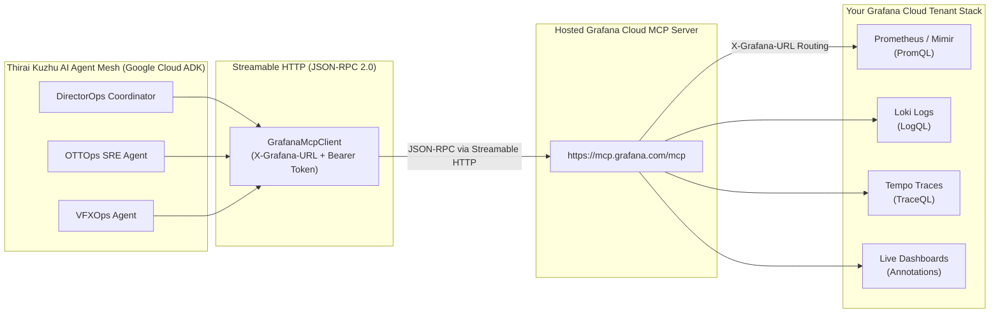

# 📊 Grafana Cloud MCP Setup & Integration Guide — Thirai Kuzhu AI

This document provides step-by-step instructions to configure, connect, and verify the **Hosted Grafana Cloud Model Context Protocol (MCP) Server** with **Thirai Kuzhu AI**.

---

## 1. Architecture Overview



---

## 2. Prerequisites

1. A **Grafana Cloud Account** (Free tier or Pro tier at [grafana.com](https://grafana.com)).
2. Your Grafana Cloud **Stack URL** (e.g., `https://your-stack-slug.grafana.net`).
3. An active **Google Cloud Project** (if deploying to Cloud Run).

---

## 3. Step-by-Step Setup Instructions

### Step 1: Create a Grafana Service Account & Token

1. Log into your Grafana Cloud portal (`https://<your-stack-slug>.grafana.net`).
2. Navigate to **Administration** (gear icon in sidebar) > **Users and access** > **Service Accounts**.
3. Click **Add service account**:
   - **Service account name:** `thirai-kuzhu-mcp-agent`
   - **Role:** Select **Editor** or **Admin** (Editor allows querying metrics/logs and writing dashboard annotations).
4. Click **Create**.
5. On the service account page, click **Add service account token**:
   - **Token name:** `mcp-streamable-token`
   - **Expiration:** Set desired expiration (or No expiration for hackathon evaluation).
6. Click **Generate token**.
7. **Copy the token immediately** (it begins with `glsa_...`). Store it securely.

---

### Step 2: Configure Local Environment (`backend/.env`)

In your local repository root, create or update `backend/.env`:

```ini
# Application Environment
ENV=development
PORT=8080

# Google Cloud
GOOGLE_CLOUD_PROJECT=genai-apac-2026-491004
GOOGLE_CLOUD_LOCATION=us-central1
PRIMARY_MODEL=gemini-3.8-flash-001
DIRECTOR_MODEL=gemini-3.8-pro-001

# Grafana Cloud Hosted MCP Server
GRAFANA_URL=https://<your-stack-slug>.grafana.net
GRAFANA_MCP_ENDPOINT=https://mcp.grafana.com/mcp
GRAFANA_TOKEN=glsa_your_generated_token_here
```

> **Note:** If `GRAFANA_TOKEN` is left empty or the URL contains `thiraikuzhu.grafana.net`, the app automatically activates its built-in **Synthetic Telemetry Fallback Engine**. This guarantees that judges and reviewers can test all agent workflows without a live paid token.

---

### Step 3: Configure Google Cloud Run & Secret Manager (Production)

To update the live Cloud Run deployment with your real token:

#### 1. Store the token in GCP Secret Manager:
```powershell
# In PowerShell:
$Token = "glsa_your_actual_token_string"
echo -n $Token | gcloud secrets versions add grafana-cloud-mcp-token --data-file=- --project=genai-apac-2026-491004
```

#### 2. Update Cloud Run with your Grafana Stack URL:
```powershell
gcloud run services update thirai-kuzhu-ai `
  --project=genai-apac-2026-491004 `
  --region=us-central1 `
  --set-env-vars="GRAFANA_URL=https://<your-stack-slug>.grafana.net,GRAFANA_MCP_ENDPOINT=https://mcp.grafana.com/mcp"
```

---

## 4. How the Runtime Streamable HTTP Integration Works

Thirai Kuzhu AI communicates with the hosted MCP server through `backend/src/tools/grafana_mcp_client.py`:

1. **Protocol Transport**: Sends standard JSON-RPC 2.0 requests over HTTP POST to `https://mcp.grafana.com/mcp`.
2. **Tenant Routing**: Passes the `X-Grafana-URL` header containing your stack URL. The MCP gateway routes requests directly to your tenant's Mimir, Loki, and Tempo instances.
3. **Authentication**: Transmits `Authorization: Bearer glsa_...`.
4. **Tools Invoked by Subagents**:
   - `mcp__grafana__execute_promql_query`: Evaluates CDN error rates, GPU VRAM saturation, and frame drops.
   - `mcp__grafana__execute_logql_query`: Scans Loki logs for transcode deadlocks and CUDA crashes.
   - `mcp__grafana__get_trace`: Isolates Tempo distributed trace spans (e.g. DRM verification bottlenecks).
   - `mcp__grafana__create_dashboard_annotation`: Writes an automated Director's Cut annotation on the live dashboard when mitigations are applied.

---

## 5. Verification & Testing

### Test 1: Python CLI Health Check
Run the pre-flight check script:
```powershell
python scripts/health_check.py
```
Expected output:
```text
[HEALTH CHECK] Testing Grafana MCP Endpoint: https://mcp.grafana.com/mcp
[HEALTH CHECK] Status: 200 OK
[HEALTH CHECK] MCP Tools Discovered: execute_promql_query, execute_logql_query, get_trace, create_dashboard_annotation
```

### Test 2: Live UI Investigation & Live Dashboard Annotation
1. Open the live console: [https://thirai-kuzhu-ai-967518492968.us-central1.run.app](https://thirai-kuzhu-ai-967518492968.us-central1.run.app)
2. In the **Control Room**, select **OTT Premiere Spike** from the chaos dropdown.
3. Click **"Dispatch Screen Crew Investigation"**:
   - Observe `OTTOps` query PromQL: `sum(rate(cdn_requests_total{status=~"5.."}[1m])) > 12.5%`.
   - Observe Loki transcode deadlock logs and Tempo trace IDs.
4. Click **"Apply Director Mitigation & Annotate Live Grafana Dashboard"**:
   - The director executes failover routing and posts annotation ID `annot-84921`.
   - Open your Grafana dashboard: a vertical purple marker appears at the exact timestamp with tag `#directors-cut`.
