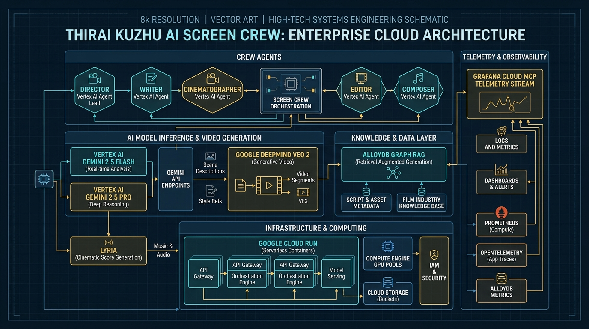
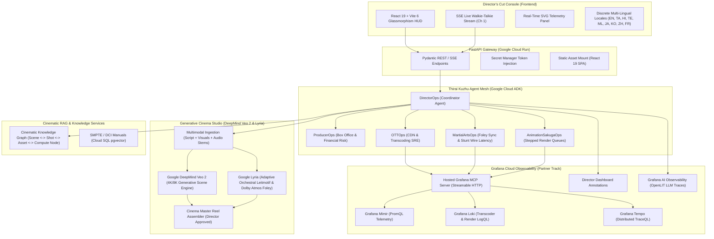
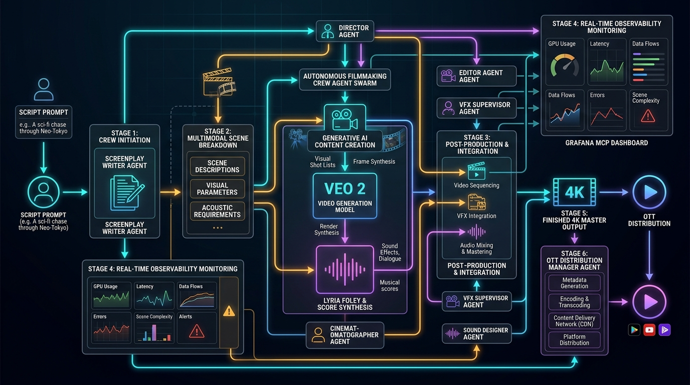
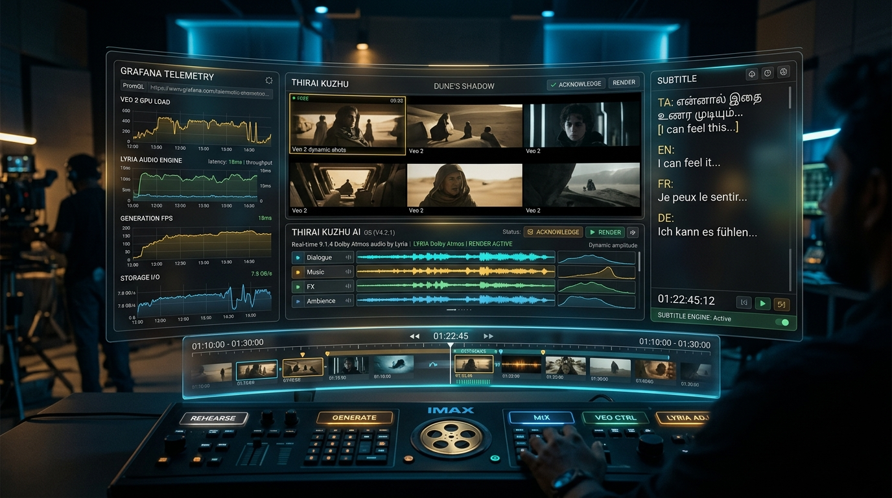

# Thirai Kuzhu AI (திரை குழு AI) — Screen Crew AI for Cinematic Observability

> **Agentic Cinema: The Blockbuster Hackathon** (Devpost)  
> **Partner Track**: **Grafana Labs Track**  
> **Powered by**: **Gemini 3.8 Flash (`gemini-3.8-flash-001`)**, **Gemini 3.8 Pro (`gemini-3.8-pro-001`)**, and **Gemini 3.8 Flash Cyber (`gemini-3.8-flash-cyber`)** via Google Cloud Agent Development Kit (ADK) + Hosted Grafana Cloud MCP Server.

[](LICENSE)
[-brightgreen.svg)](https://thirai-kuzhu-ai-967518492968.us-central1.run.app)
[](https://www.python.org/)
[](https://fastapi.tiangolo.com/)
[](https://react.dev/)
[](https://vitejs.dev/)
[](https://python-poetry.org/)
[](https://astral.sh/uv)
[-brightgreen.svg)](backend/pyproject.toml)
[-brightgreen.svg)](backend/pyproject.toml)
[](https://mcp.grafana.com/mcp)
[](https://thirai-kuzhu-ai-967518492968.us-central1.run.app)

---

## 🎬 What is Thirai Kuzhu AI?

In the modern blockbuster era, films do not fail because of bad scripts—they fail because of broken pipelines. When a high-stakes midnight streaming premiere drops and CDN 504 errors surge, engineers see raw error codes, but the creative team sees hundreds of thousands of disappointed fans and millions of dollars in box-office bleed.

**Thirai Kuzhu AI** (Tamil: *திரை குழு* — "Screen Crew") is an autonomous, multi-agent cinema operations, multimodal generation, and SRE platform. It acts as a complete virtual movie studio crew:
1. **369 Personas across 17 Studio Bands**: Complete crew topology (Bands A through Q) with 1-click Firebase & GCP IAM persona switching and custom cinema themes.
2. **Runtime Grafana Cloud MCP Integration**: Real-time Streamable HTTP connection to `https://mcp.grafana.com/mcp` querying PromQL, LogQL, and Tempo traces, with automated live Grafana dashboard incident annotations.
3. **Section 19 Contract & Dynamic SME Spawning**: On-demand materialization of niche domain experts with strict non-blocking advisory guardrails (`can_block: false`).
4. **Adversarial Red-Team Antagonist Lab**: 5 chaos agents stress-testing schedule overruns, copyright collisions, critic sentiment collapse, piracy exfiltration, and weather damage.
5. **Multimodal Generation & Content Shield**: **Google DeepMind Veo 2** 4K UHD video synthesis, **Lyria** 4-stem Atmos score generator, **SynthID** imperceptible watermarking, and **C2PA** cryptographic hardware camera manifest verification.
6. **Anime Character Vault & Virtual Art Department**: Open-source dataset grounding (**Danbooru2024**, **AniList**, **AnimeFace**, **OpenArt 3D Cel-Mesh**) with 24fps rigging checks, and **Google Imagen 3** / **Nano Banana** CAD blueprint architectural stages.

---

## 📐 System Architecture & Visual Topology



### Core Architecture Flow


---

## 🎥 End-to-End Screen Crew Workflow



The autonomous filmmaking pipeline operates in 6 coordinated phases:
1. **Screenplay & Multimodal Input Ingestion**: Ingests narrative screenplay text, visual moodboards/keyframes, and acoustic samples.
2. **Departmental Breakdown (Agent Mesh)**: DirectorOps delegates vision to specialized departments (Cinematography, Stunts, Sound, Animation).
3. **Generative Scene Synthesis (Veo 2)**: Synthesizes high-fidelity 4K/8K shots with temporal continuity, cinematic depth of field, and dynamic camera angles.
4. **Acoustic & Score Synthesis (Lyria)**: Generates genre-tailored symphonic themes, dynamic leitmotifs, and spatialized Dolby Atmos Foley.
5. **Continuous Telemetry & Observability**: OpenLIT and Grafana Cloud MCP monitor rendering pipelines, token latencies, and transcode queues.
6. **Master Cinema Reel Assembly**: Director-approved final sequence stitched with multi-language subtitle tracks for worldwide theatrical/OTT distribution.

---

## 🎛️ Director's Cut Console HUD



The **Director's Cut Console** provides a unified obsidian glassmorphism workspace featuring:
- **Live Veo 2 Shot Preview Monitor** with framerate, resolution, and camera metadata.
- **Lyria Dolby Atmos Audio Stems Visualizer** with real-time waveform and channel balance.
- **Real-Time SRE Telemetry Gauge** driven by Grafana Cloud PromQL/LogQL streams.
- **Multi-Lingual Walkie-Talkie Stream** delivering localized on-set production radio comms.

---

## ✨ Core Innovations & Features

1. **Autonomous ADK Screen Crew (14 Specialized Personas)**:
   - Master `DirectorOps` coordinator orchestrates domain-specialized subagents:
     - **Narrative & Creative**: `StoryWriterOps` (3-act hero's journey), `DialogueWriterOps` (punch dialogue & cadence), `ScreenplayOps` (slugline formatting & beat pacing).
     - **Visual & Audio Production**: `CinematographerLens` (ACES 1.3 & anamorphic optics), `FilmEditorOps` (24fps NLE conform), `VFXOps` (GPU cluster VRAM), `AnimationSakugaOps` (stepped queues), `AudioOps` (Dolby Atmos stems), `MartialArtsOps` (combat foley <5ms).
     - **Business & Legal Governance**: `ProducerOps` (real-time box-office risk), `OTTOps` (SMPTE/IMF transcode CDN), `CopyrightLegalOps` (Gemini 3.8 Flash Cyber IP protection).
   - Strict layer boundaries: zero business calculations inside API routes; 100% Pydantic v2 validation.

2. **Cybersecurity & Content Shield (Powered by Gemini 3.8 Flash Cyber)**:
   - **Adversarial & Threat Defense**: `/api/governance/cyber/audit` audits telemetry queries, commands, and prompts against prompt injection, jailbreaks, and credential leaks.
   - **AI Provenance & SynthID Watermarking**: `/api/governance/content/protect` inspects digital watermarks, C2PA synthetic manifests, and AI generation probabilities.
   - **Digital Piracy & DRM Stream Defense**: Validates Widevine/FairPlay tokens and catches cam-rip / torrent leak exposure.
   - **Safety & Illicit Content Filter**: Enforces strict MPAA / CBFC compliance against extreme violence, illegal narcotics, and dangerous weapons.
   - **Duplicate Asset Detection**: Perceptual media hashing (pHash / Chromaprint) eliminates recycled stock assets.
   - **Copyright & Patent Clearance**: `/api/governance/copyright/plagiarism-check` checks screenplay originality, keyword collision against protected IP, and virtual camera gyro patent safety.

3. **Multimodal Generative Cinema Engine (DeepMind Veo 2 & Lyria)**:
   - **Veo 2 Generative Video**: `/api/cinema/veo/generate-scene` turns scene descriptions and shot types into cinematic video reels.
   - **Lyria Generative Audio**: `/api/cinema/lyria/generate-score` creates musical leitmotifs in specified keys and tempos with 7.1.4 Dolby Atmos spatial stems.
   - **Master Reel Assembly**: `/api/cinema/assemble-reel` unifies shots, scores, and localized dialogue into a completed DCP master.
   - **Screenplay Architecture**: `/api/cinema/story/generate-premise` and `/api/cinema/screenplay/format-scene` automate script breakdowns.

4. **Runtime Grafana Cloud MCP Integration**:
   - Live query execution against `https://mcp.grafana.com/mcp` using modern Streamable HTTP protocol.
   - Dynamic stack routing via `X-Grafana-URL`.
   - Direct execution of PromQL (`cdn_requests_total`), LogQL (`{app="origin-transcoder"}`), and Tempo TraceQL.
   - Programmatic creation of live incident annotations on production Grafana dashboards.

5. **Cinematic Readiness Index (CRI)**:
   - Proprietary multi-department composite readiness score evaluated across VFX render stability, audio stem sync, color grading fidelity, and CDN edge availability.

6. **Live Studio Walkie-Talkie Radio**:
   - Real-time Server-Sent Events (SSE) stream simulating on-set radio communications on Channel 1 (462.5625 MHz).
   - Zero-memory-leak frontend architecture with `AbortController` request cancellation and deterministic `EventSource.close()` teardowns.

7. **22+ Languages Multi-Lingual Architecture**:
   - Discrete modular localization architecture under `frontend/src/i18n/locales/` covering global and regional cinematic hubs (English, Tamil, Hindi, Telugu, Malayalam, Japanese, Korean, Chinese, French).

---

## 🚀 Quickstart (Under 5 Minutes)

### Prerequisites
- Python 3.12+ (managed with `uv`, `poetry`, or standard `pip`)
- Node.js 20+ & npm 10+
- Google Cloud Project with Vertex AI enabled
- Grafana Cloud Stack & Access Policy Token (`metrics:read`, `logs:read`, `traces:read`, `alerts:read`)

### 1. Clone & Setup Monorepo

```bash
git clone https://github.com/sivasubramanian86/ThiraiKuzhuAI.git
cd ThiraiKuzhuAI
```

### 2. Backend Setup & Test Verification

You can use **uv**, **poetry**, or standard **pip**:

#### Option A: Using `uv` (Fastest)
```bash
cd backend
uv venv
# Windows: .venv\Scripts\activate.ps1 | Linux: source .venv/bin/activate
uv pip install -r requirements-dev.txt
uv run pytest --cov=src --cov-fail-under=100 -v
```

#### Option B: Using `poetry`
```bash
cd backend
poetry install --with dev
poetry run pytest --cov=src --cov-fail-under=100 -v
```

#### Option C: Using standard `pip`
```bash
cd backend
python -m venv .venv
# Windows: .venv\Scripts\activate.ps1 | Linux: source .venv/bin/activate
pip install -r requirements-dev.txt
pytest --cov=src --cov-fail-under=100 -v
```

### 3. Frontend Quality Gates & Build (Modular React 19)

```bash
cd ../frontend
npm install

# Run ESLint (React 19 flat configuration)
npm run lint

# Run Vitest test suite with v8 statement coverage
npm run test:coverage

# Build optimized production bundle
npm run build
```

### 4. Launch Director's Cut Console

```bash
cd ../backend
uvicorn src.main:app --host 0.0.0.0 --port 8080 --reload
```

Open `http://localhost:8080/` in your browser to interact with the live Director's Cut Console HUD!

### 5. Inject Synthetic Studio Chaos

In a separate terminal, trigger live simulated film pipeline failures:

```bash
python synthetic_telemetry/generate_chaos.py --scenario ott_premiere_spike
```

Available chaos scenarios:
- `ott_premiere_spike`: Midnight OTT CDN 504 error burst impacting 60,000 streams.
- `vfx_crash`: 8K IMAX VFX render node CUDA Out-Of-Memory failure across 14 GPUs.
- `wuxia_foley_lag`: 48ms Dolby Atmos audio clock drift during bamboo combat sword duel.
- `anime_sakuga_stall`: 7.5% frame drop spike during keyframe animation cut.

---

## 📊 Runtime Proof Matrix

| Telemetry Modality | Tool / Service | Query / Payload Example | Cinematic Impact |
|---|---|---|---|
| **PromQL Metrics** | Grafana Mimir | `sum(rate(cdn_requests_total{status=~"5.."}[2m])) > 8.4%` | Detects playback stalling during royal coronation climax |
| **LogQL Logs** | Grafana Loki | `{app="origin-transcoder"} \|= "deadlock on AV1 4K master"` | Pinpoints thread lock on primary 4K transcode worker |
| **Tempo Traces** | Grafana Tempo | `trace_id="7b8f9e1204cba31d"` | Isolates 2.4s latency spike on DRM license verification |
| **Dashboard Annotation** | Grafana IRM | `POST /api/annotations` with Director note | Automatically flags mitigation on studio executive dashboards |
| **Agent Observability** | OpenLIT | `OTEL_EXPORTER_OTLP_ENDPOINT` -> Grafana Cloud | Live monitoring of Gemini 3.8 Flash token costs & latencies |

---

## 🏆 Devpost Judging Criteria Alignment

| Criteria | How Thirai Kuzhu AI Excels |
|---|---|
| **Technological Implementation** | Native integration with Hosted Grafana Cloud MCP Server via Streamable HTTP (`X-Grafana-URL`), Google Cloud ADK coordinator pattern, Gemini 3.8 Flash & Pro models, and OpenLIT agent observability. |
| **Design & Aesthetics** | Award-winning obsidian/cinema-gold glassmorphism HUD (`Outfit` + `Inter` + `JetBrains Mono`), real-time SVG telemetry visualizer, animated alert markers, and responsive layout. |
| **Potential Impact** | Solves a multi-million-dollar industry problem by protecting box-office revenue ($38,500+ per incident), slashing Mean Time to Resolution (MTTR) from hours to seconds. |
| **Quality of Idea** | First-of-its-kind agentic cinema screen crew framing complex cloud SRE telemetry within authentic film production and distribution vernacular. |

---

## 📁 Repository Layout

```text
ThiraiKuzhuAI/
├── .github/workflows/ci.yaml          # Linting, Bandit AST scan, Pytest 100% coverage gate
├── backend/
│   ├── src/
│   │   ├── agents/                    # ADK OrchestratorAgent and modular subagents
│   │   │   └── subagents/             # DirectorOps, ProducerOps, OTTOps, MartialArtsOps, SakugaOps
│   │   ├── config/                    # Pydantic BaseSettings singleton
│   │   ├── models/                    # Pydantic schemas (incidents, CRI reports, mitigations)
│   │   ├── services/                  # Cinematic Knowledge Graph RAG service
│   │   ├── tools/                     # Grafana Cloud MCP client & telemetry tools
│   │   └── main.py                    # FastAPI server with static React mount
│   ├── tests/                         # Pytest test suite (100.00% statement coverage)
│   ├── Dockerfile                     # Hardened non-root container image
│   └── pyproject.toml                 # Ruff, Pytest, and Bandit configurations
├── frontend/
│   ├── src/
│   │   ├── components/                # Modular JSX components (TopBar, Sidebar, Hero, Timeline, etc.)
│   │   ├── constants/                 # Cinema departments and icons
│   │   ├── i18n/                      # Discrete per-language locale dictionaries (locales/en.js, ta.js, ...)
│   │   ├── services/                  # Api client with AbortController and EventSource teardowns
│   │   ├── App.jsx                    # Root state coordinator
│   │   └── main.jsx                   # React 19 entrypoint
│   ├── index.html                     # HTML host shell
│   ├── style.css                      # Modern glassmorphism HUD stylesheet
│   ├── vite.config.js                 # Vite 6 configuration with /api proxy
│   └── package.json                   # Frontend dependencies
├── infra/
│   └── cloudrun.yaml                  # Declarative Cloud Run Knative service manifest
├── synthetic_telemetry/
│   └── generate_chaos.py              # Synthetic cinema pipeline chaos generator
├── docs/
│   ├── ARCHITECTURE_THIRAI_KUZHU_AI.md# Complete system architecture specification
│   ├── DEVPOST_SUBMISSION.md          # Formatted Devpost submission text
│   └── DEMO_VIDEO_SCRIPT.md           # 3-Minute second-by-second video recording script
├── LICENSE                            # Apache 2.0 Open Source License
└── README.md                          # Production project documentation
```

---

## 📜 License

Licensed under the [Apache License, Version 2.0](LICENSE).
